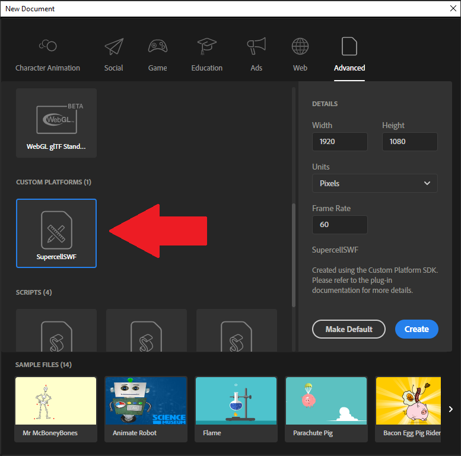
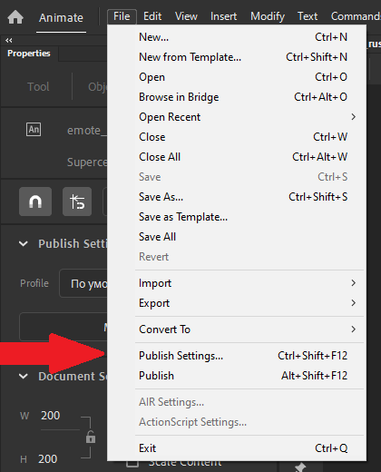

<h1 align="center" style="font-size: 32px;"> Supercell Animate </h1>

### Supercell Animate is a custom platform addon and extension for Adobe Animate. This extension will allow you to create custom documents and export content of your library directly to a .sc file.

 

# Disclaimer
This repository does not provide any instructions on how to modify any Supercell game or their assets. All information and all Assets were taken from public sources. You assume all risks from the use of this tool.

# Table Of Content

- [Export features](#export-features)
- [How to use](#how-to-use)
- [Limitations](#limitations)
- [Issues](#issues)
- [Requirements](#requirements)
- [Installing](#installing)
- [Dependecies](#dependecies)
- [Building](#building)
- [Examples](#examples)
- [Changelog](#changelog)
- [Authors](#authors)
- [Support](#support)

 

# Support
This project was created with the goal of exploring various interesting tools and to support a small but quite creative community of modders. I put a lot of heart and time into this creation, so if you want to support me, you can buy me a coffee right here :3  

 

# Export features
- Stroke  / Fills / Brushes ✅  
Full support. It can be unstable sometimes especially with big fills and curves so try to work more with sprites

    - Fill styles ❌  
    Now only solid color works and there are no plans for other styles.

- Filters ❌  
There will be no support for filters for Symbols

- Scripts (ActionScript, JavaScript) ❌  
.sc file does not support any scripts

- Sounds ❌  
.sc file does not support sounds

- Parenting / Camera / Advanced Layers ❌  
There are <strong>currently</strong> no plans for support.

- Text ✅  
Partial support

- Symbols (Graphic, MovieClip) ✅  
Full support except for "Button" type

    - Blending modes ✅  
    Full support. But note that some modes may not work or crash.

    - Trasform ✅ 
    2D Transforms are fully supported. 3D transformations have a potentially small range of uses and a small chance of being supported.

- Layers ✅  
All types of layers are supported: Normal, Masks, Folders, Guides
Also note that all symbols from guide layer will be ignored and will only be used for animation if necessary.

- Classic / Animation tweens ✅  
Absolutely all types of animation tweens and their types of interpolation are supported.

 - Shape animation ✅  
Full support. Be careful when using it, the result can be very unoptimized.

- Nine-slice ✅  
Full support. But keep in mind that on Animate 2024 and above this may not work correctly.
 

# How to use
- Check [requirements](#requirements), make sure everything is satisfied
- [Install](#installing) or [build](#building) extension
- Open your Adobe Animate and go to New Document panel
- Create new "SupercellSWF" document: 

- Create something!  
In [examples](#examples) you can find good and different use cases for extension in different games!  
Also, before creating something, do not forget to read information about ["limitations"](#Limitations) that will help you not to create any problems.

- To set export options you need to click "File -> Publish Settings.."  
You can set all options here for the first time only once and then just press "Publish" button. You can also find a description of all options in ["Publisher options"](#publisher-options)

- After setting all options, you can click on publish button. You are great!  
Then you just need to wait until file is saved. Please note that in some rare cases this may take up to 10 minutes!  

 

# Limitations

## Color transforms
Be careful when transforming colors. Color values can only be positive, otherwise these values will be set to zero and the result will be undesirable.

## Text Fields
Text fields are covered with a large layer of mystique.  
But there is also support for basic things here.
Also be careful, not all settings can somehow affect text in final file (because they cannot be disabled, Animate just crashes)  
Also, text must have no more than 255 characters, otherwise text will not be written to file.
To enable text outline you need to add "Glow" filter to text field

 

# Requirements
For extension to work correctly, you need:

- Adobe Animate 2020 or higher
- Windows 10 x64 or Windows 11

Please note that support for a macOS devices is <em><strong>possible</strong></em>, but not implemented simply due to the fact that I do not have a device for this on which I can develop this project

 

# Installing

 

# Dependecies
There will be a list of other people's projects that have been used here:
- JS
    - [React](https://github.com/facebook/react): UI framework for Publisher settings panel
- C++
    - [OpenCV](https://github.com/opencv/opencv) Computer vision library for image processing: [Apache License 2.0](https://github.com/opencv/opencv/blob/4.6.0/LICENSE)
    - [Libnest2d](https://github.com/tamasmeszaros/libnest2d) Great library for packing polygons. Used to create texture atlases: [LGPL-3.0 License](https://github.com/tamasmeszaros/libnest2d/blob/master/LICENSE.txt)
    - [wxWidgets](https://github.com/wxWidgets/wxWidgets) Cross-platform and simple library for creating an UI in C++. Used to create a progress window during export: [wxWidgets license](https://github.com/wxWidgets/wxWidgets/blob/master/docs/licence.txt)
    - [CDT](https://github.com/artem-ogre/CDT/) Library for polygon triangulation. Used to triangulate fills and stroke: [MPL-2.0 License](./plugin/ThirdParty/CDT/LICENSE)
    - [spdlog](https://github.com/gabime/spdlog) Fast logging tool: [MIT License](https://github.com/gabime/spdlog/blob/v1.x/LICENSE)
    - [json](https://github.com/nlohmann/json) Fast json serializer/deserializer
    - Data compression libraries:
        - LZMA: [Source](https://7-zip.org/sdk.html)
        - ZSTD [Git](https://github.com/facebook/zstd), [BSD / GPL2 License](./plugin/ThirdParty/SC/dependencies/Compression/dependencies/zstd/LICENSE)
        - LZHAM: [Git](https://github.com/richgel999/lzham_codec)
        - ASTC:  [Git](https://github.com/ARM-software/astc-encoder), [Apache License 2.0](https://github.com/ARM-software/astc-encoder/blob/main/LICENSE.txt)

 

# Building
Before starting you need to have:
- [npm and node.js](https://nodejs.org/)
- [Typescript and ts-node](https://www.npmjs.com/package/ts-node)
- MSVC Build tools (Visual Studio)

Instruction will be divided into 2 parts, instructions for building Plugin and Publish settings

- PublishSettings  
    Open console in "publisher" folder and enter following command to install all dependencies needed for build:  
    `
    npm i --save-dev
    `  
    After installation, try to start local server with command:  
    `
    npm run start
    `  
    Try opening `localhost:8080` in your browser. If page works and you see the publisher interface, then everything is OK!

- Plugin  
    Make sure you have installed Visual Studio with C++ build tools and also cmake which should be in system variables or PATH. That's all!  

Next, after preparing all modules, you need to open console in root of repository.
- Debug  
    If you want to use a debug build you need to use several commands:  
    `
    npm run build:dev
    `  
    `
    npm run deploy
    `  
    After that, extension should load into Adobe Animate.
- Release
    To build a zxp package, you need to fill in certificate details in `scripts/cert.ts` and then run following command:
    `
    npm run package
    `
    After command completes, you should have an zxp package at root of repository that you can install.

 

# Examples
You can find a list of all available examples in ["examples"](/examples/README.md) folder.

 

# Issues
If you find any problem with the export process, please report it in [Issues](https://github.com/sc-workshop/SupercellSWF-Animate/issues) or [join our Discord Server](https://discord.gg/uPnDsns6G6)  
Also, native part of plugin saves logs in "%temp%/org.scWorkshop.SupercellSWF_export_log.txt", please provide them along with a description for a faster solution to the problem.

 

# Changelog
## v 1.2.1
- Added experimental installer
## v 1.2.0
- Complete refactoring of code
- Changed and improved design of Publisher Settings
- More animations for Publisher progress window
- Improved support for Fills and Strokes. Added rasterization to sprites
- Added new algorithm to reduce shape object count 
- Added support for 9slice scaling
- More bugs
## v 1.1.0
- Added support for blend modes
- Added basic support for solid fills and stroke
- Added experimental shape animation
- Added support for group
## v 1.0.1
- Fixed sprite transformation
- Updated localization
## v 1.0 
- First release. Basic export to .sc file

 

# Authors

The idea of this project was created in my head for a year and code for the first version was written in a few months and during this time a lot of people became "authors".
Without their support or some information at this time, this project simply would not exist and people would continue to edit sc in json files (People who do this are very patient and strong people. If you see them on the street, run).  
And even at the time of writing this text, this is already a very big and interesting adventure for me, where for the first time I was able to "prove" myself in so many areas such as creating html "web sites" (A publisher is literally a very simple web site), creating libraries and programs with an UI in C++.  
I hope that in the future I can continue in the same mood and continue to do programming, improving my skills as a programmer.  
### And let's say thanks to those who somehow helped this project:

 

## [Pavel Sokov](https://github.com/pavel-sokov)  
Thanks to Fred for listening to my crazy Illuminati theories all this time and still not blocking my messages.
Also, thanks for a lot of things like SWF module, sc2json converters, etc...

 

## [Danila Schelkov](https://github.com/danila-schelkov) (Also known as Vorono4ka) 
Famous author of the most unoptimized and most used tool for _tex.sc files - [XCoder](https://github.com/xcoder-tool/XCoder)  
Also known a bit for [SC-editor](https://github.com/danila-schelkov/sc-editor) (I think it's because it can't edit or even export movie clips :) ).  
Also thanks for support during this time and many other things that helped write Supercell SWF library.

 

## [Barak Levy](https://github.com/baraklevy20)
A cool author of some scripts and modules from which some implementations for plugin code were taken.

 

## And me, DaniilSV
Dude who created this, and writes this text. Yes.

 