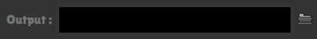
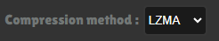
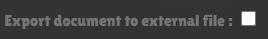
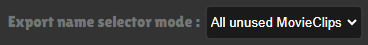
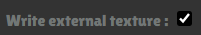
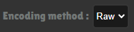
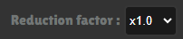

<p align="center">

<h1 align="center" style="font-size: 32px;"> Supercell Animate </h1>
</p>

### Supercell Animate is a custom platform addon and extension for Adobe Animate. This extension will allow you to create custom documents and export content of your library directly to a .sc file.

<br/>

# Disclaimer
This repository does not provide any instructions on how to modify any Supercell game or their assets. All information and all Assets were taken from public sources. You assume all risks from the use of this tool.

# Table Of Content

- [Export features](#export-features)
- [How to use](#how-to-use)
- [Limitations](#limitations)
- [Publisher options](#publisher-options)
- [Requirements](#requirements)
- [Installing](#installing)
- [Dependecies](#dependecies)
- [Building](#building)
- [Examples](#examples)
- [Authors](#authors)


<br/>

# Export features
- Stroke  / Fills / Brushes❌  
Partial support planned

- Filters ❌  
There will be no support for filters for Symbols

- Scripts (ActionScript, JavaScript) ❌  
.sc file does not support any scripts

- Sounds ❌  
.sc file does not support sounds

- Parenting / Camera / Advanced Layers ❌  
There are <strong>currently</strong> no plans for support.

- Text ✅  
Partial support

- Symbols (Graphic, MovieClip) ✅  
Full support except for "Button" type

    - Blending modes ❌  
    Blending modes are currently not supported, but partial support is planned. This is not a very important and not very often used element, so it has a low priority.

    - Trasform ✅ 
    2D Transforms are fully supported. 3D transformations have a potentially small range of uses and a small chance of being supported.


- Layers ✅  
All types of layers are supported: Normal, Masks, Folders, Guides
Also note that all symbols from guide layer will be ignored and will only be used for animation if necessary.

- Classic / Animation tweens ✅  
Absolutely all types of animation tweens and their types of interpolation are supported.

<br/>

# How to use
- Check [requirements](#requirements), make sure everything is satisfied
- [Install](#installing) or [build](#building) extension
- Open your Adobe Animate and go to New Document panel
- Create new "SupercellSWF" document: 

<p align="center">

</p>

- Create something!  
In [examples](#examples) you can find good and different use cases for extension in different games!  
Also, before creating something, do not forget to read information about ["limitations"](#Limitations) that will help you not to create any problems.

- To set export options you need to click "File -> Publish Settings.."  
You can set all options here for the first time only once and then just press "Publish" button. You can also find a description of all options in ["Publisher options"](#publisher-options)

<p align="center">

</p>

- After setting all options, you can click on publish button. You are great!  
Then you just need to wait until file is saved. Please note that in some rare cases this may take up to 10 minutes!  

<br/>

# Limitations

## Color transforms
Be careful when transforming colors. Color values can only be positive, otherwise these values will be set to zero and the result will be undesirable.

## Text Fields
Text fields are covered with a large layer of mystique.  
But there is also support for basic things here.
Also be careful, not all settings can somehow affect text in final file (because they cannot be disabled, Animate just crashes)  
Also, text must have no more than 255 characters, otherwise text will not be written to file.
To enable text outline you need to add "Glow" filter to text field

<br/>

# Publisher options
- Output - output .sc file name  
     

- ## Advanced settings
    - Compression type - compression method. Each method has its own performance in compression / decompression time and size. Best use ZSTD  
         

    - External file - You can export your document to another sc file, for example this way you can export documents with different FPS.  
    After activating flag, a field for selecting a file will appear below.   
         

    - ## Exports
        term "Export name" - MovieClip that you can use outside of .sc file. Other MovieClips do not have names and because of this can only be used in a file.

        - Export name selector - With this setting, you can change MovieClip selection method for export name.  
        

    - ## Textures
        - External texture - Flag for writing _tex.sc file. Otherwise, texture is written in one .sc file.  
             

        - Encoding method - Specifies texture write method. Raw mode is written quickly but has a large size and is slower to load into memory. KTX takes time to encode, bu file is smaller and loads faster.  
             

        - Texture quality -  
           Small quality - Bad texture quality and minimum size  
            Highest quality - Original quality, large size  
             

        - Reduction factor - Value by which size of each sprite is reduced.  
         If value is x1.0 then size of sprite does not change   
             

        - Texture width and height - Indicates maximum texture size that will be generated by sprite atlas generator.  
             

<br/>

# Requirements
For extension to work correctly, you need:

- Adobe Animate 2020 or higher
- Windows 10 x64 or Windows 11

Please note that support for a macOS devices is <em><strong>possible</strong></em>, but not implemented simply due to the fact that I do not have a device for this on which I can develop this project

<br/>

# Installing
To install, you will need to download and install ["Anastasiy's Extension Manager"](https://install.anastasiy.com/)  
Then download zxp package from [releases](https://github.com/Daniil-SV/SupercellSWF-Animate/releases)
Open extension manager, click on "Install" button and then select zxp package you downloaded  
After a successful installation notification, you can close program and open Adobe Animate for use

<br/>

# Dependecies
There will be a list of other people's projects that have been used here:
- [React](https://github.com/facebook/react): Interface for Publisher settings panel
- [Libnest2d](https://github.com/tamasmeszaros/libnest2d): Great library for packing polygons. Used to create texture atlases
- [wxWidgets](https://github.com/wxWidgets/wxWidgets): Cross-platform and simple library for creating an interface in C++. Used to create a progress window during export
- Data compression algorithms:
    - [LZMA](https://7-zip.org/sdk.html)
    - [ZSTD](https://github.com/facebook/zstd)
    - [LZHAM](https://github.com/richgel999/lzham_codec)
    - [ASTC](https://github.com/ARM-software/astc-encoder)

<br/>

# Building
Before starting you need to have:
- [npm and node.js](https://nodejs.org/)
- [Typescript and ts-node](https://www.npmjs.com/package/ts-node)

Instruction will be divided into 2 parts, instructions for building Plugin and Publish settings

- PublishSettings  
    Open console in "publisher" folder and enter following command to install all dependencies needed for build:  
    `
    npm i --save-dev
    `  
    After installation, try to start local server with command:  
    `
    npm run start
    `  
    Try opening `localhost:8080` in your browser. If page works and you see the publisher interface, then everything is OK!

- Plugin  
    Make sure you have installed Visual Studio with C++ build tools and also premake5 which should be in system variables or PATH.  
    To install most dependencies you need to run "update_submodule" script in `plugin/scripts/`. Also note, dependency download process can be a bit long.  
    But you need to build wxWidgets yourself and copy everything to plugin/ThirdParty/wxWidget.  
    Final file structure should look like this:  
    ```
    ThirdParty \  
        wxWidget \
            include \
                *.h
            lib \
                vc_x64_lib \
                    *d.lib
                    *.lib

    ```
    After preparing  dependencies, try to generate solution. Open console in `plugin/scripts/` and run script "generate

Next, after preparing all modules, you need to open console in root of repository.
- Debug  
    If you want to use a debug build you need to use several commands:  
    `
    npm run build:dev
    `  
    `
    npm run deploy
    `  
    After that, extension should load into Adobe Animate.
- Release
    To build a zxp package, you need to fill in certificate details in `scripts/cert.ts` and then run following command:
    `
    npm run package
    `
    After command completes, you should have an zxp package at root of repository that you can install.

<br/>

# Examples
You can find a list of all available examples in ["examples"](/examples/README.md) folder.

<br/>

# Authors

The idea of this project was created in my head for a year and code for the first version was written in a few months and during this time a lot of people became "authors".
Without their support or some information at this time, this project simply would not exist and people would continue to edit sc in json files (People who do this are very patient and strong people. If you see them on the street, run).  
And even at the time of writing this text, this is already a very big and interesting adventure for me, where for the first time I was able to "prove" myself in so many areas such as creating html "web sites" (A publisher is literally a very simple web site), creating libraries and programs with an UI in C++.  
I hope that in the future I can continue in the same mood and continue to do programming, improving my skills as a programmer.  
### And let's say thanks to those who somehow helped this project:

<br/>


## [Pavel Sokov](https://github.com/pavel-sokov)  
Thanks to Fred for listening to my crazy Illuminati theories all this time and still not blocking my messages.
Also, thanks for a lot of things like SWF module, sc2json converters, etc...

<br/>


## [Danila Schelkov](https://github.com/danila-schelkov) (Also known as Vorono4ka) 
Famous author of the most unoptimized and most used tool for _tex.sc files - [XCoder](https://github.com/xcoder-tool/XCoder)  
Also known a bit for [SC-editor](https://github.com/danila-schelkov/sc-editor) (I think it's because it can't edit or even export movie clips :) ).  
Also thanks for support during this time and many other things that helped write SWF module.

<br/>


## [Barak Levy](https://github.com/baraklevy20)
A cool author of some scripts and modules from which some implementations for plugin code were taken.

<br/>


## And me, DaniilSV
Dude who created this, and writes this text. Yes.