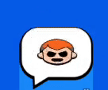

<h1 align="center" style="font-size: 26px;"> Animated emote in Brawl Stars </h1>

All sources are in ["emote_rusty.fla"](./emote_rusty.fla) file  
Emote made by [Bitowsky](https://twitter.com/Bitowsky1)

 

Emotes in Brawl Stars are usually animated sprites that transforms and change color.  
Pins should be approximately 60x60, but even if you have an emotion (or you need to set clear boundaries for animation process) you can change symbol type of this emotion to "Graphics", create a new MovieClip with same name (but in a different directory) put emotion into a new MovieClip and then you can use textfields to "delimit" size and borders.
In example, in emote MovieClip, you can find "Bound" layer which you can copy and use as a scaling tool.  
This border is only needed for animator. It doesn't affect rendering of the file or anything something like this.

Rusty emote

