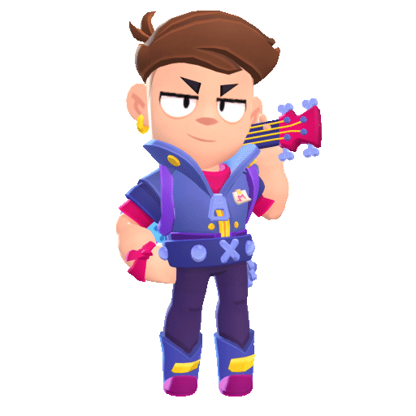
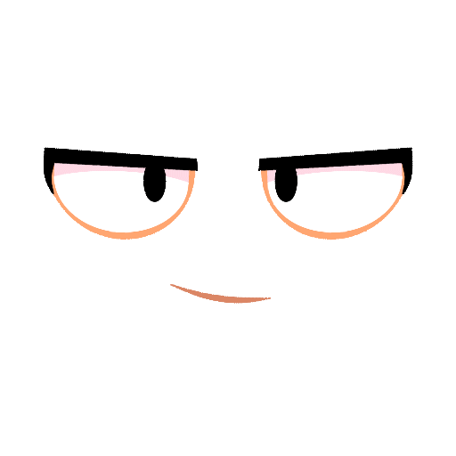

<h1 align="center" style="font-size: 26px;"> Animated face in Brawl Stars </h1>

All sources are in ["molyan_face.fla"](./molyan_face.fla) file  

 

The faces may look a little confusing at first, but there is no magic here.  
To start animating you need a brawler texture with a size of 1024x1024 (size is very important)  
Then put the texture in the top right corner  
After that you can animate face on the texture and it will work in game.

Face in Flash and 3D

