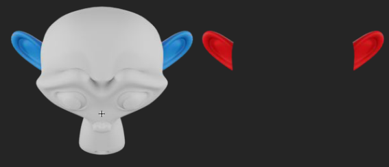
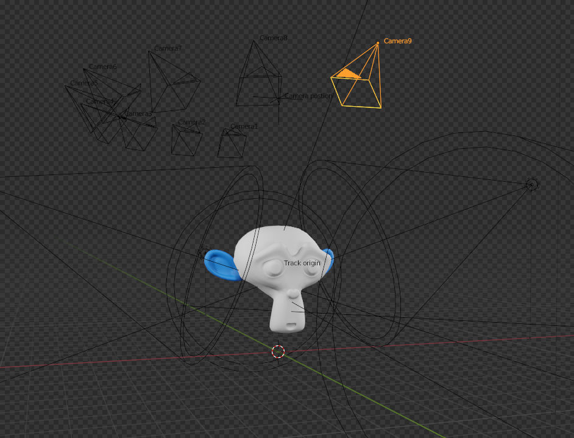
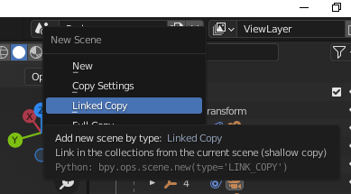
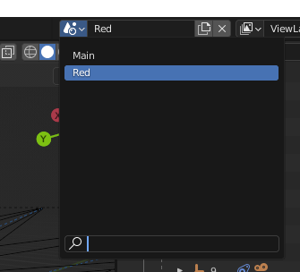
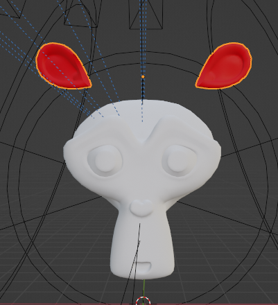
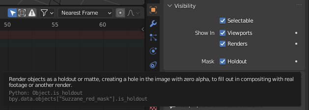
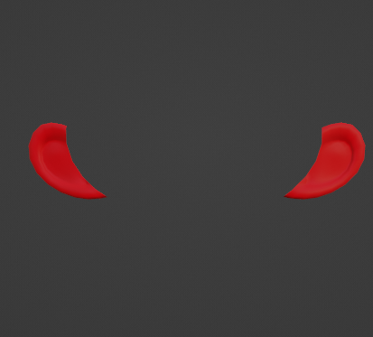

<h1 align="center" style="font-size: 32px;"> Clash Royale Character </h1>

All 2D sources are in ["chr_suzanne.fla"](./chr_suzanne.fla) file  
All 3D model sources are in ["chr_suzanne.blend"](./chr_suzanne.blend) file  
Character made by DaniilSV and Willem-Paul van Overbruggen

 

All characters in Clash Royale are a very cool mixture of Flash and 3d technologies.
In total, there are 9 virtual cameras in Clash Royale (a.k.a. view sides).  
Each complex animation must be rendered 9 times around 180 degrees.  
 You may have a question: Why exactly 180 degrees and not 360? The answer is very simple. Resource usage optimization.  
 The game just takes one side and mirrors, because of this, there is no need to render a model with 18 cameras around 360 degrees.  

 

Monkey Royale

 

## Why is Flash a very important tool in optimization?
With Flash, you can create a simple animation that will save you tons of unnecessary sprites and take up less space in memory.  
As an example - Suzanne run animation. In our case, we could do a full 3d render, but that would take a lot of resources. Instead, we created a simple Flash animation that does almost the same effect with minimal loss.  

 

## Masks

Masks are also one of the very important optimization tools.
In case of characters, masks are needed, to create a character for enemy team without completely re-rendering character to save resources.

Red team mask in Adobe Animate

 

## How to create 3D character in Blender
There will be no 3D modeling lessons here so let's just take Suzanne as an experimental character object.  
Put your character on stage.  
Create 9 cameras around 180 degrees. Also in example .blend file, you can find a ready and convenient camera system that you can set up for another character.  
Create lighting for character.  
Make or edit character animations.  
Select scene settings you want and make sure you turn on render with transparency.  
Also at this point, I recommend planning which animations will be static or animated in flash, and for which it will be necessary to render the entire animation. This will save a lot of time rendering useless sprites.

chr_suzanne scene in Blender

After that, you need to render each animation you need from each camera and save it to some folder.  
I did it in "Render" folder but didn't include it in repository because it's too big, so you can find source of all sprites in project for Adobe Animate.

 

## How to create mask in Blender
To create a mask similar to this in Blender you can create a linked copy of scene with your character for red character.  

Separate desired part from model that should become a mask. 

Create a new material for this part and give it a new color.  
Then for the rest of model you need to enable "Holdout" option:

If you did everything right then the end result will look something like this:

After that, render each animation from all cameras🎉

 

## Working with Flash

In this example, there are only 3 basic and implemented animations "run1", "idle1" and "attack1" for blue and red team.  
 
All your movie clips must have the following naming convention:  
"{Name of your character}_{Animation name like "run1" etc.}_{Camera number from 1 to 9}"  
Mini tip: If you're using masks, then it's very useful to make symbols of type "Graphics" that combine the base sprite and the mask. It's not required, but just convenient.
You need to import all your sprites  
Create the necessary movie clips and animate it.  
The average character size is 100x100 pixels and the average duration of animation should be somewhere around 20-30 frames.  
But usually for such animation, 2 - 2.5 times fewer sprites are used from number of frames, and each sprite can be displayed 2 or 3 frames, depending on "sharpness" of animation.